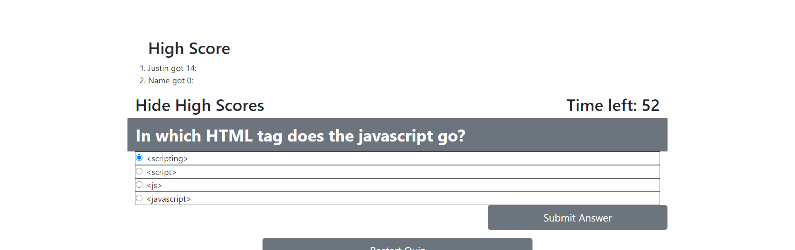

Homework 4

This work is done as an assignment for coding bootcamp.  The file provides a coding quiz for the taker in such a way that 
i) The quiz will be timed.
ii) One multiple choice question will appear on the screen at a time.
iii) When a question is answered, the next question will appear.
iv) If a question is incorrect, a portion of the time left (10 seconds) will be taken away.
v) When the time runs out, or all questions are answered, the quiz will end.
vi) The score for the quiz will be the amount of time left on completion.
vii) This score will then be compared to the highscore which is saved locally.

Note that the questions are modified from those on the JavaScript quiz from W3Shool [W3School](https://www.w3schools.com/quiztest/quiztest.asp?qtest=JS).

The deployed page is at [webpage](https://jalbert12485.github.io/homework-4/) and a screenshot is below.
